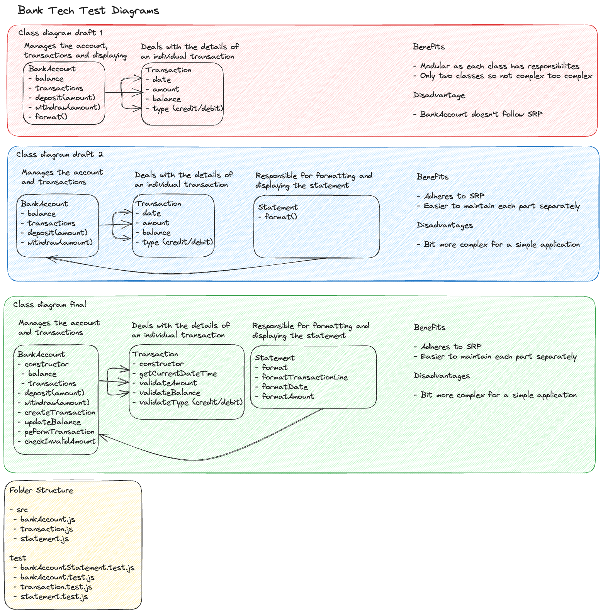

# Bank tech test

## Instructions

### To install the app:

- Clone this repo
- Run `npm install` to install dependencies

### To use the app:

- Run `node` to open the node REPL
- Require the BankAccount class with `const BankAccount = require('./src/BankAccount');`
- Create a new bank account with `const account = new BankAccount();`
- Deposit money with `account.deposit(1000);` (replace 1000 with the amount you want to deposit)
- Withdraw money with `account.withdraw(500);` (replace 500 with the amount you want to withdraw)

### To print your statement:

- Require the Statement class with `const Statement = require('./src/statement');`
- Create a statement with `const statement = new Statement(account.transactions);`
- Print your statement with `console.log(statement.format());`

### To run the tests:

- Run `npm test` to run the tests

## Test coverage report


File            | % Stmts | % Branch | % Funcs | % Lines | Uncovered Line #s 
----------------|---------|----------|---------|---------|-------------------
All files       |     100 |      100 |     100 |     100 |                   
 bankAccount.js |     100 |      100 |     100 |     100 |                   
 statement.js   |     100 |      100 |     100 |     100 |                   
 transaction.js |     100 |      100 |     100 |     100 |                   

Test Suites: 4 passed, 4 total
Tests:       26 passed, 26 total
Snapshots:   0 total
Time:        0.294 s, estimated 1 s

## Specification

### Requirements

- You should be able to interact with your code via a REPL like IRB or Node. (You don't need to implement a command line interface that takes input from STDIN.)
- Deposits, withdrawal.
- Account statement (date, amount, balance) printing.
- Data can be kept in memory (it doesn't need to be stored to a database or anything).

### Acceptance criteria

**Given** a client makes a deposit of 1000 on 10-01-2023  
**And** a deposit of 2000 on 13-01-2023  
**And** a withdrawal of 500 on 14-01-2023  
**When** she prints her bank statement  
**Then** she would see

```
date || credit || debit || balance
14/01/2023 || || 500.00 || 2500.00
13/01/2023 || 2000.00 || || 3000.00
10/01/2023 || 1000.00 || || 1000.00
```

## Observations:

- The statement is printed in reverse chronological order
- The date is formatted DD/MM/YYYY on the statement
- The date is formatted DD-MM-YYYY in the specification
- The amount is formatted to 2 decimal places on the statement
- The amount is formatted to no decimal places in the specification
- Each column is separated by 2 pipes (||)
- The first line is a header
- Shows a running balance
- credit and debit are differentiated by || so debit has || on the left and credit has || on the right

## Questions (Sent to client on 22/05/23 at 12:34pm - responses below):

1. Can the account balance go negative?

- Worth taking into consideration as a edge case. For now, assume no.

2. Can there be multiple deposits/withdrawals on the same day? How should these be ordered?

- Yes, same order as accepted criteria. (reverse chronological)

3. Is there a maximum number of transactions that can be shown on the statement?

- No

4. What happens if the user tries to withdraw more money than they have in their account?

- Edge case, assume no.

5. What happens if the user tries to withdraw or deposit 0 or a negative amount?

- Edge case, assume no.

6. What happens if the user tries to deposit or withdraw a float? Should this be rounded to 2 decimal places only?

- As per the acceptance criteria, assume no.

7. Should the code handle any specific errors or exceptions, such as invalid dates, strings or floats over or below 2 decimal places?

- Yes, handle these errors.

8. Should the credit and debit column have a + or - symbol to differentiate between the two?

- No as per acceptance criteria.

9. The inputs are deposit and withdrawal but no date. Should this be an input or defaulted to todays date?

- Whichever would reduce the risk of human error. (So default to todays date and time for the transaction.)

## User Stories:
```
As a user, I want to deposit money into my account.
As a user, I want to withdraw money from my account.
As a user, I want to see my account balance.
As a user, I want to print my account statement to view my account history.
As a user, I want to see the date of each transaction in my account history.
As a user, I want to see the amount of each transaction in my account history.
As a user, I want to see the balance after each transaction in my account history.
As a user, I want to see my transactions in reverse chronological order in my account history.
As a user, I want to view my transactions in a readable format in my account history.
```
## Approach
```
Deposits:
Should accept a valid deposit amount (integer or float up to 2 decimal places). - DONE
Should update the balance with the deposit amount. - DONE
Should reject invalid deposit amounts (negative, non-numeric). - DONE
Should store the transaction with a auto generated timestamp. - DONE

Withdrawals:
Should accept a valid withdrawal amount (integer or float up to 2 decimal places). - DONE
Should update the balance by deducting the withdrawal amount. - DONE
Should reject invalid withdrawal amounts (negative, non-numeric, larger than balance). - DONE
Should store the transaction with a auto generated timestamp. - DONE

Account statement:
Should print all transactions in reverse chronological order. - DONE
Each transaction should include: date, credit or debit, balance after transaction. - DONE
The formatting should match the provided criteria. - DONE
```
## Diagram:



## Input -> Output table:

| Method   | Input | Output               |
| -------- | ----- | -------------------- |
| deposit  | 1000  | balance becomes 1000 and new transaction added |
| withdraw | 500   | balance becomes 500 and new transaction added  |

| Property | Value     |
| -------- | --------- |
| date     | 10-01-2023 |
| amount   | 1000      |
| balance  | 1000      |
| type     | credit    |

| Method         | Input (BankAccount transactions)                  |
| -------------- | ------------------------------------------------- |
| format | [{date: '10-01-2023', amount: 1000, balance: 1000, type: 'credit'}, {date: '14-01-2023', amount: 500, balance: 500, type: 'debit'}] |

Output (console):
```
date || credit || debit || balance
14/01/2023 || || 500.00 || 500.00
10/01/2023 || 1000.00 || || 1000.00
```

## TDD Red, Green, Commit, Refactor, cycle rules followed:

- Create a feature test to test the user stories. (Normal)
- Use mocks to isolate unit tests. (Normal)
- 95% test coverage. (Normal)
- Test for behavior not state where possible. (Additional)
- Clear test descriptions. (Additional)
- Use appropriate testing framework methods to keep code clean (Additional)
- Create unit tests for each class and method.
- Use SRP to keep classes and methods small and testable.

## Completed:

1. The BankAccount class is interactable via a REPL like Node.
2. Deposit and withdrawal methods are implemented with necessary validations.
3. All data (transactions) are being kept in memory.
4. The error cases have been handled, like trying to withdraw more money than the balance or depositing or withdrawing an invalid amount.
5. Implement the format method to display the statement.
6. Format the output of the format method to match the provided format.
7. Format the timestamp for each transaction to be able to print the date in the statement.
8. Used ESLint to ensure code is clean and readable.

## Learning resources:

- [Private methods in JavaScript](https://www.javascripttutorial.net/javascript-private-methods/)